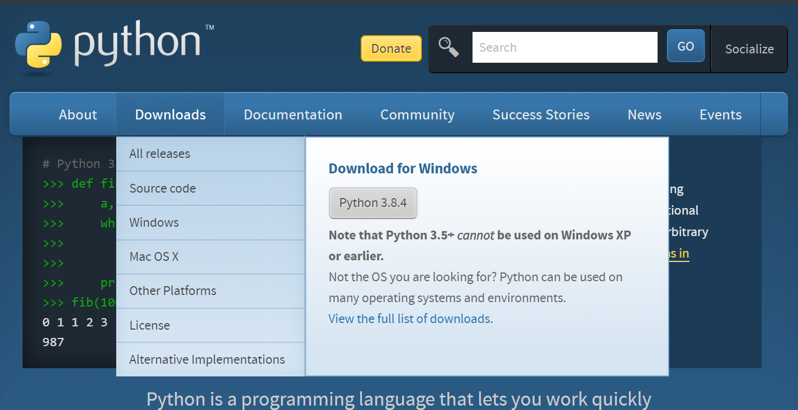
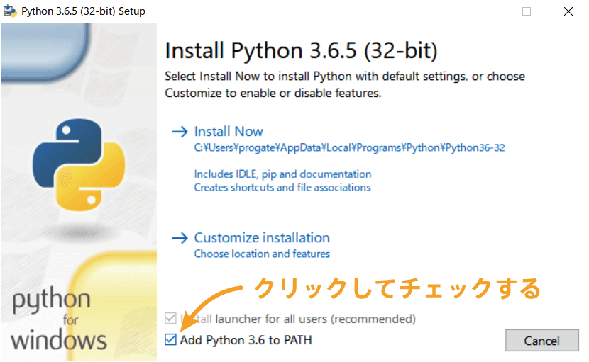

# dis_file_bot

## install

[python](https://www.python.org/)の公式ページにアクセスし、灰色のボタンを押してダウンロードする。

ダウンロードしたexeファイルを開いて、Add python to PATHにチェックを必ずいれる。

コマンドプロンプトでdis_file_botに移動し、以下コマンドを実行し、各ライブラリをインストール

    /dis_file_bot> pip install -r requirements.txt

アプリケーションを実行するコマンド

    /dis_file_bot> python main.py

